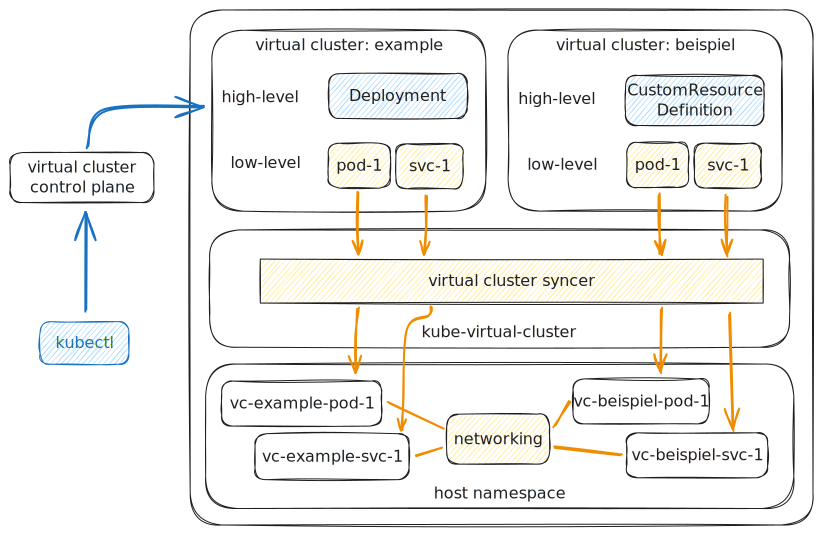
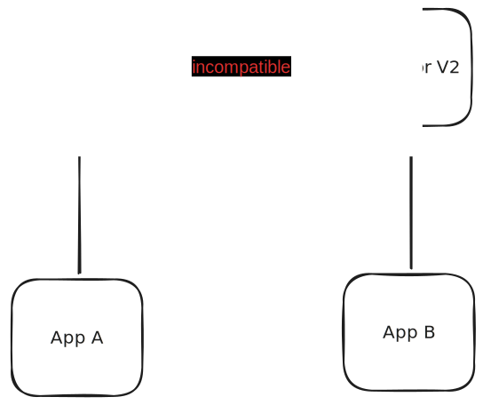
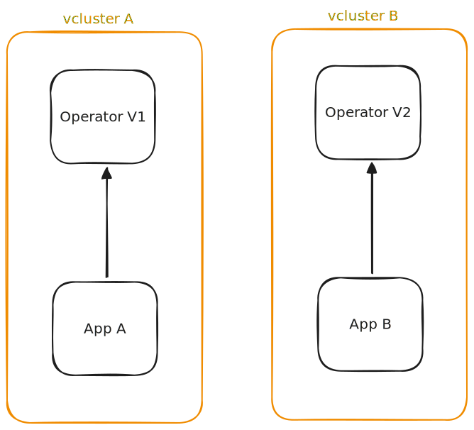

+++
title = "Performance and usability analysis of virtual clusters in Kubernetes"
outputs = ["Reveal"]

+++

<link rel="stylesheet" href="//unpkg.com/@catppuccin/highlightjs/css/catppuccin-macchiato.css">

<section data-noprocess>
<h1 align="left">Performance and usability analysis of virtual clusters in
Kubernetes
<!--  -->
</h1>
</section>

---
{}

# Kubernetes

---

## What is Kubernetes

{}Container orchestration{}
{}Cloud-native{}
{}Open-source{}
{}Since 2014{}

---

## Kubernetes Cluster

{}The greatest unit of Kubernetes{}
{}A set of machines called nodes{}
{}Nodes are VMs or physical machines{}
{}The control plane manages the Nodes{}

---

## Modifying Kubernetes

{}Modular design{}
{}Stable interfaces{}
{}Parts can be exchanged for others{}
{}Tooling works with no regard to distribution{}
{}_in theory_{}

---

## Kubernetes Distributions

{}Kubernetes is a platform{}
{}Distributions are implementations{}
{}Distributions are opinionated{}
{}Distributions are not interchangeable{}

---

### Notable Distributions

{}**Vanilla Kubernetes (k8s)**{}
{}**k3s**{}
{}k0s{}
{}MicroK8s{}
{}_any many others_{}

{}

---
{}

# Virtual Clusters

---

## What is a Virtual Cluster

{}It is [`vcluster`](https://www.vcluster.com/)!{}
{}A Kubernetes cluster inside a cluster{}
{}But not really{}
{}Subdivision of a real Kubernetes cluster{}

---


## How `vcluster` works?

---

## Advantages of `vcluster`

{}Easy **creation** and **deletion**{}
{}**Small overhead**, compared to separate clusters{}
{}All resources **mapped** to the host cluster{}
<!-- {}Solves Operator version conflicts {} -->

{}

---
{}

<h1 align="center">Kubernetes Operator   Version Conflicts</h1>

---

## Kubernetes Operators

{}Operators are Kubernetes applications{}  
{}They manage other applications{}
{}They are installed as Kubernetes resources{}
{}`CustomResourceDefinition` + controller (in a pod){}
---



---

## How can `vcluster` help?

---


---

## Is this a good solution?

<!-- Table of pros and cons -->

<table>
<th class="fragment" data-fragment-index="10">Pros</th>
<th class="fragment" data-fragment-index="20">Cons</th>
<hor>
<tr>
<td class="fragment" data-fragment-index="11">Easy to use</td>
<td class="fragment" data-fragment-index="21">Performance overhead</td>
</tr>

<tr>
<td class="fragment" data-fragment-index="12">Both apps just work</td>
<td class="fragment" data-fragment-index="22">Added dependency</td>
</tr>

<tr>
<td class="fragment" data-fragment-index="13">Apps in different clusters</td>
<td class="fragment" data-fragment-index="23">Apps in different clusters</td>
</tr>
<!-- <tr>
<td class="fragment" data-fragment-index="14">No need to modify the operator</td>
<td class="fragment" data-fragment-index="24">Not a complete solution</td>
</tr> -->
</table>

---

## Testing

{}Conducted testing with 2 CRDs{}
{}These CRDs were incompatible{}
{}Used `vcluster` to solve the conflict{}
{}`vcluster` allowed both of the CRDs to be applied{}

{}

---
{}

# `vcluster` Performance

<!-- ⚠️ Bright slides ahead ⚠️ -->

---

## Test scenarios

{}

---
{}

# PostgreSQL

> 
throughput testing

---

## Methodology

{}Used `pgbench` with different scales{}
{}Used `S = 10, 20, 50, 100, 200`{}
{}Used `pgbench` inside `vcluster`{}
{}Used `pgbench` outside `vcluster`{}

---

# Results

---


### `S = 10` RO

---


### `S = 10` R/W

---


### `S = 100` RO

---


### `S = 100` R/W

---


### Comparison of different S values (RO) 

---


### Comparison of different S values (R/W) 

{}

---
{}
# Kafka 
> 
latency testing

---

## Methodology

{}Created a **custom** benchmarking tool{}
{}Measured **end-to-end latencies**{}
{}Measured with different numbers of{}

Producers

Consumers

{}Run the same tests in:{}

<code style="color: #fab387">vcluster</code>

conventional Kubernetes cluster

---

## Results

---


### Means of latencies

---


### Means of 90th percentile of latencies

---


### Means of 99th percentile of latencies

{}

--- 
{}
# Future work

{}Test with more applications{}
{}Tests with a massive multi-`vcluster` environment{}
{}Security implications{}
{}Test with more complex scenarios{}
{}Test with more complex scenarios{}

{}

---
# Thank you!
